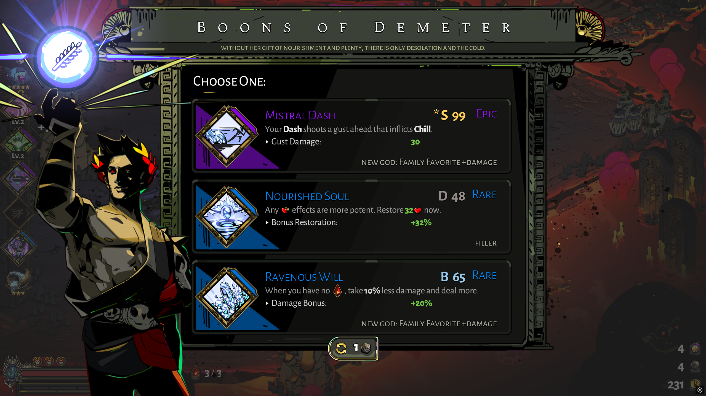

# BoonAdvisor

BoonAdvisor is an in-game decision aid for the original **Hades**. It ranks the
choices offered during an escape attempt and explains which option best fits
the current run.



The `*` marks the recommended available option.

> **Status:** Experimental. Recommendations are build-aware heuristics, not a
> guarantee of the strongest possible build or a successful clear.

## Features

- Advises on boons, Daedalus Hammers, Poms, Chaos, doors, Charon's shop, the
  Well of Charon, the two Trial of the Gods pickups, keepsakes, story-room
  rewards, and the Pool of Purging.
- Shows how far the starred option is ahead (`* S 95 +14`), so a coin flip
  reads differently from a landslide, and says when a weak screen from a new
  god is worth walking away from.
- Suggests a Fated Persuasion reroll on the boon screen and a Fated Authority
  reroll when every exit on offer is poor.
- Ranks the choices offered by Sisyphus, Eurydice, and Patroclus using the
  current run state.
- Reads the active weapon aspect, held boons, Mirror talents, biome, health,
  Death Defiances, gold, keepsake, and Pact conditions.
- Recommends a single keepsake to keep or switch to using the remaining biome,
  build route, eligible god offers, accumulated bonuses, and survival state.
- Derives duo and legendary prerequisites, eligibility, replacements, and
  exclusions from the game's own data.
- Calculates legal reroll probabilities directly from the game's offer rules
  without sampling or changing the run's random seed.
- Includes preferences for all 24 weapon aspects and 31 build archetypes.
- Shows a rank and short reason without changing controls, saves, or gameplay.

## Installation

No mod manager or runtime dependency is required.

1. [Download the latest source archive](https://github.com/BoasHoeven/hades-boon-advisor/archive/refs/heads/main.zip)
   and extract it.
2. Run the installer for your platform.
3. Start Hades.

### Windows

Right-click `install.ps1` and select **Run with PowerShell**, or run:

```powershell
powershell -ExecutionPolicy Bypass -File install.ps1
```

### Linux, macOS, and Steam Deck

```bash
chmod +x install.sh
./install.sh
```

For a non-standard installation, pass the Hades directory containing
`Content/`:

```powershell
powershell -ExecutionPolicy Bypass -File install.ps1 -GamePath "D:\Games\Hades"
```

```bash
./install.sh /path/to/Hades
```

Game updates and Steam file verification can remove the mod's import line.
Re-run the installer if the overlay disappears.

## Uninstalling

```powershell
powershell -ExecutionPolicy Bypass -File uninstall.ps1
```

```bash
./uninstall.sh
```

The uninstaller removes the Import line from the current `RoomManager.lua` in
place, so a game updated since installation keeps its updated script.

## Configuration

The three settings most players change sit at the top of
[`mod/BA_Config.lua`](mod/BA_Config.lua): `Objective`, `ShowReason`, and
`LogPicks`. Everything below the "you probably do not need to touch it" line
is tuning: weights, colours, text placement, door and shop tables. Baseline
ratings and build archetypes are in [`mod/BA_Ratings.lua`](mod/BA_Ratings.lua).

Reroll advice compares the best current option with the exact expected value
of the legal replacement pool. `RerollMinExpectedGain`,
`RerollMinImprovementChance`, and the reroll cost settings control how
selective it is.

Set `Objective` to `"Balanced"`, `"Speed"`, or `"HighHeat"`. Balanced is the
default. Speed favours established fast routes and combat-free chambers.
HighHeat places more value on survival and prices risky rooms more heavily.
Active Pact conditions are always read independently of this preference,
including healing and prices, disabled Mirror rows, enemy hit shields, weighted
combat danger, Approval Process, and Tight Deadline rank and remaining time.

Re-run the installer after editing either file. For implementation details and
game-code references, see [`docs/MECHANICS.md`](docs/MECHANICS.md).

## Recommendation scope

BoonAdvisor is designed for general escape consistency. A single universal
"best build" does not exist: the best choice changes with the aspect, current
offers, player execution, Heat setup, and whether the goal is safety or speed.

The prerequisite and eligibility logic is derived from game data. Baseline
ratings and archetypes are hand-tuned. Boon-screen advice is the most mature;
door, shop, and keepsake scoring should be treated as experimental.

Optional pick logging records every offer with its score breakdown, the
option taken and the margin by which the star was ahead, one line per room
with clear time and damage taken, and a run summary. Run results are evidence
for tuning rather than proof of causation.

## Local run telemetry

Set `LogPicks = true` in `mod/BA_Config.lua`, then re-run the installer. The mod
will append decisions, room outcomes and run summaries to
`BoonAdvisor-runs.log` beside the Hades save files on Windows, or in the home
directory on Linux/macOS (see `LogFilePath` in `mod/BA_Config.lua`). The log
stays local and is not part of the game save. Leave logging disabled for
normal play and enable it only while collecting diagnostics.

Trait names are the game's internal names so lines can be joined regardless
of language. `score=` and `best=` are what the screen showed; `margin=` is the
model's own gap before the display scale compresses the top end, which is
what makes an overrule evidence (`+14`) or noise (`+1`).

```text
=== BoonAdvisor v1.14.0 objective=Balanced ratings=7f3a9c21 channel=queued saveignores=true ===
[offer] run=12 objective=Balanced weapon=BowWeapon aspect=BowMarkHomingTrait biome=Tartarus depth=8 heat=0 hp=85/100 dd=2 gold=140 rerolls=1 loot=DionysusUpgrade | *DionysusSecondaryTrait=96(S) base=68 slot=8 hit=8 aspectTrait=5 archetype=18 | FountainDamageBonusTrait=72(B) base=76 depth=6 | kind=boon margin=31 reason="core of the Chiron Hangover build" | reroll=no expected=91 gain=-5 chance=12% cost=1 | build=AphroditeWeaponTrait@Rare
[took ] run=12 ... kind=boon loot=DionysusUpgrade taken=DionysusSecondaryTrait score=96.3 recommended=DionysusSecondaryTrait best=96.3 margin=0 followed=true reason="core of the Chiron Hangover build"
[room ] run=12 ... room=A_Combat05 encounter=GeneratedA type=Default clear=31.4 damage_taken=19 hit=true timer=- next=ZeusUpgrade
[door ] run=12 ... took=ZeusUpgrade margin=0 followed=true reroll=false | >*ZeusUpgrade=78 | Money=52 | build=...
[run-end] run=12 ... result=death time=1310 room=C_Boss01 killer=Theseus damage_taken=412 | build=...
```

Analyze the current save history and local telemetry without modifying the
save (or only the log, with `--telemetry-only`):

```bash
python tools/analyze_runs.py
```

The report is per decision rather than per run: every overrule sorted by
margin with the clear time and damage of the next three rooms relative to
that run's median, which star reasons and score terms show up mostly in
overruled picks, the follow rate per advisor (boon, door, shop, Well, purge,
keepsake, story), and the rooms with a damage spike together with the three
decisions before them. Clear-rate comparisons are printed only once a bucket
holds ten runs; with fewer, read the per-decision tables instead.

## Tests

The test suite runs the real mod sources against the installed game's data:

```bash
pip install lupa
python tests/test_boonadvisor.py
python tests/test_performance.py
```

It contains more than 100 assertions covering scoring, prerequisites,
exclusions, Mirror and Pact handling, objective profiles, doors, shops,
keepsakes, logging, save safety, exact offer probabilities, and live-screen
performance budgets. Exhaustive aspect validation and analysis scripts are documented in
[`tests/README.md`](tests/README.md).

## Contributing

Feedback and pull requests are welcome, particularly for ratings, archetypes,
and results from real runs.

## License

[MIT](LICENSE). Hades is copyright Supergiant Games. This is an unaffiliated fan
project and includes no game assets.
